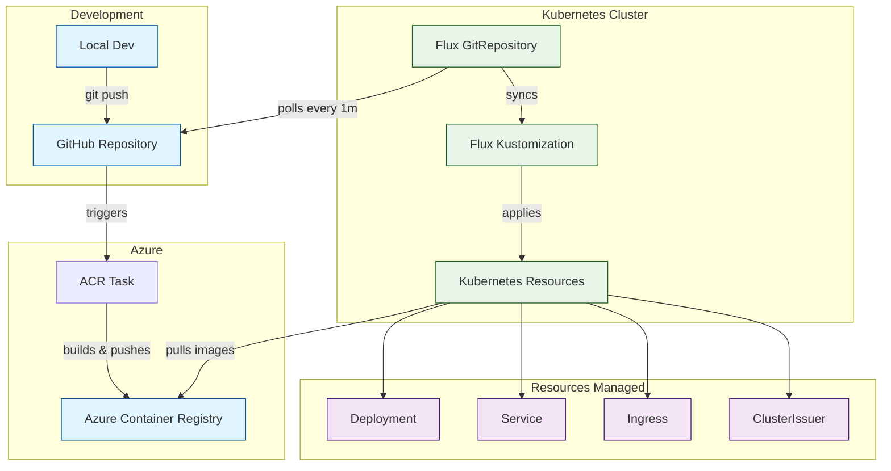

# Container Image Build Workflow



## Setup Instructions

1. Configure environment variables:
   ```bash
   cp .env.example .env
   # Edit .env with your settings:
   # - ACR_NAME: Your Azure Container Registry name
   # - ACR_RESOURCE_GROUP: Resource group containing your ACR
   # - GITHUB_TOKEN: Personal access token with repo access
   # - GITHUB_REPO: Your repository (e.g., studioqsrl/archiverse_v4)
   # - TASK_NAME: Name for the ACR task
   ```

2. Run the setup script:
   ```bash
   cd infrastructure/image
   ./setup-acr-task.sh
   ```

## Testing and Monitoring

1. Test the build process:
   ```bash
   cd infrastructure/image
   ./test-build.sh
   ```
   This will:
   - Add a timestamp to Dockerfile
   - Commit and push the change
   - Trigger ACR Task build
   - Monitor the entire deployment process

2. Monitor an existing deployment:
   ```bash
   cd infrastructure/image
   ./monitor-deployment.sh
   ```
   This will track:
   - ACR Task build status and logs
   - Flux synchronization
   - Kubernetes deployment rollout
   - Final pod status and image version

The monitoring tools provide real-time status updates with color-coded output for:
- Build progress in Azure Container Registry
- Flux synchronization status
- Kubernetes deployment rollout
- Final deployment verification

## Flow Description

1. **Development Flow**
   - Developers push code changes to GitHub
   - GitHub webhook triggers ACR Task

2. **Azure Container Registry**
   - ACR Task automatically builds new image from Dockerfile
   - Built image is stored in Azure Container Registry

3. **Flux GitOps Flow**
   - Flux GitRepository polls GitHub every minute for changes
   - When changes are detected, Flux Kustomization applies them
   - Kubernetes resources are created/updated based on the manifests

4. **Resource Management**
   - Deployment pulls latest image from ACR
   - Service exposes the deployment internally
   - Ingress configures external access with TLS
   - ClusterIssuer manages SSL certificates
