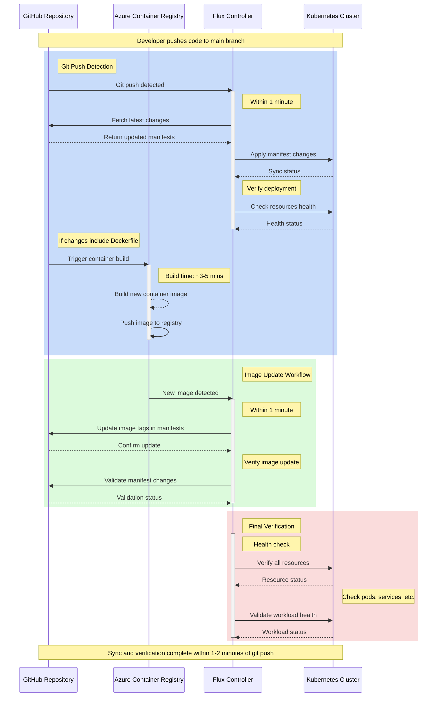

# Flux Sync Sequence

## Process Breakdown

1. **Initial Git Push Detection**: < 1 minute
   - Flux detects changes in Git repository
   - Fetches and validates new manifests
   - Applies initial manifest changes
   - Performs first health check

2. **Container Build** (if Dockerfile changes): ~3-5 minutes
   - ACR builds new container image
   - Pushes to registry
   - Triggers image update workflow

3. **Image Update Verification**: ~1 minute
   - Updates image tags in manifests
   - Validates manifest changes
   - Commits updates back to Git

4. **Final Health Verification**: ~1 minute
   - Comprehensive resource check
   - Validates all workload states
   - Confirms successful deployment

Note: While container builds take 3-5 minutes, manifest sync and verification complete within 1-2 minutes of git push. Container updates trigger a separate verification cycle.
